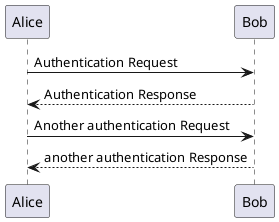

# Hallo, Doku!

> Starter-Template für die M326-Dokumentation

Dies ist die Einstiegsseite für die Projektdokumentation des Moduls M326. Ändern Sie diese wie gewünscht.

Dieses Docsify dient Ihnen als Dokumentation für die Übungen im Unterricht, der Hausaufgaben, und Ihrer Design-Pattern-Aufgabe.
Ziel ist, dass Sie für Diagramme, Beschreibungen etc. hier einen Eintrag / ein Dokument erstellen.

Repository-Inhalt
-----------------------

Dieses Repository beinhaltet:

* ein Docker-Container für [Docsify](https://docsify.js.org/) (diese Projektdoku, Port 10000, Seite: `/doc/`)
* ein Docker-Container für [PlantUML](https://plantuml.com/) (lokaler PlantUML-Render-Server, Port 10001)
* Ein **Java-Starter-Projekt** für unser fiktives Bibliothekssystem (`bibsys/`-Ordner)

Starten aller Container
------------------------

Das `docker-compose.yml` File definiert alle Dienste. Diese können gestartet werden mit:

```
# Starten aller Dienste:
$ docker-compose up
```

Danach sind folgende Dienste verfügbar:

* `plantuml`: http://localhost:10001/
* `m326-docsify`: http://localhost:10000/

Ein PlantUML-Beispiel:



Eine [Unter-Seite](sub/) ist hier zu finden.
