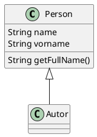

Hausaufgaben
==============

Die Hausaufgaben werden bewertet, und zählen zu 20% zur Modulnote. Ich erwarte von Ihnen jeweils eine
Abgabe eines Diagramms, einer Beschreibung, eines Programms etc via MOODLE. Diese Plattform soll Ihnen
eine einfache Möglichkeit geben, Diagramme, Beschreibungen etc. zu sammeln / zu erstellen.

Die **Design-Pattern-Aufgabe** (siehe [hier](../vortrag_design_pattern/)) zählt als **4 Hausaufgaben**.

Beispielsweise können Sie ganz einfach PlantUML-Diagramme erstellen:

Erstellen Sie pro Hausaufgabe eine eigene (Unter-)Seite.
